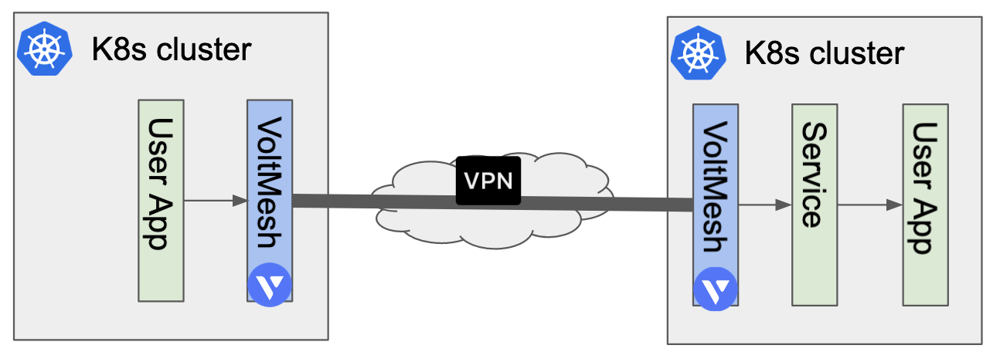
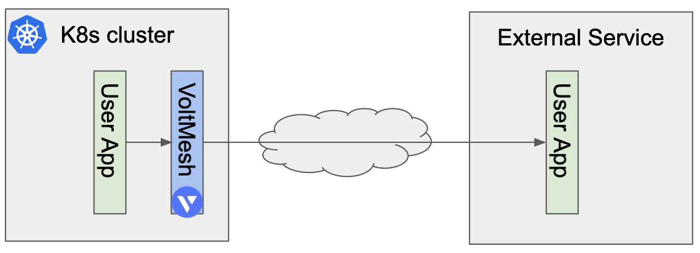
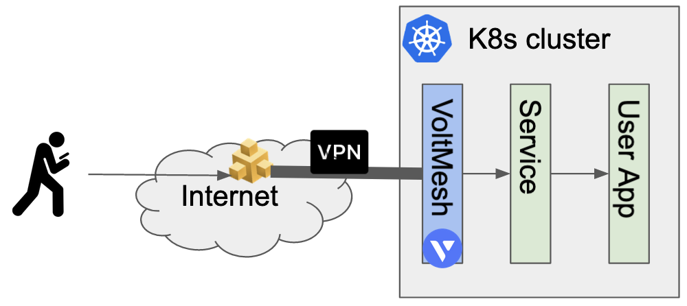

# Overview 

This document discribes how `VoltMesh on 3rd party Kubernetes` works.
Volterra related pod can run on multiple environment like EKS, AKS, Minikube and other usual Kubenretes distributions. Voltterra provides only VoltMesh featurs on them. Pod on k8s can communicate to either external network or service on external k8s via VoltMesh. Service on K8s can communicate from Internet via VoltMesh, too.

There are possible three communication patterns.

## 1. Multi cluster Service mesh

This pattern provides secure connectivity across multiple K8s cluster. App traffic to destination service is encrypted by VoltMesh.

## 2. VoltMesh Firewall to the external service

VoltMesh can apply L3-L4 Firewall and L7 HTTP based Firewall to app traffic to external service.

## 3. Internet connectivity to the kubernetes Service

Volterra Global Network provides Global IP address to bypass the user service on k8s via VoltMesh. Traffic between Volterra Global Network and VoltMesh is encrypted.

## Table of contents

1. [How VoltMesh works on 3rd party Kubernetes](./docs/1_how_to_work.md)
1. VoltMesh instration
1. VoltMesh configuration
