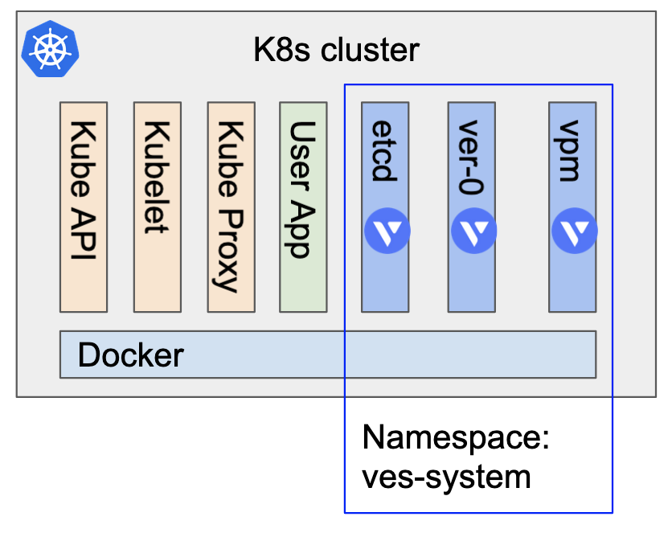
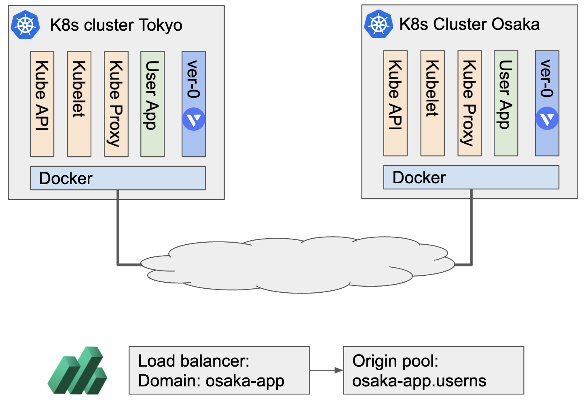
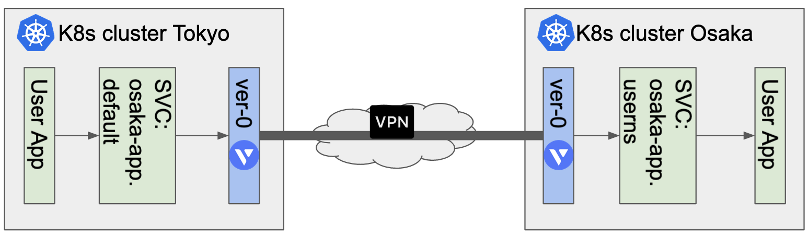

# How VoltMesh works on 3rd party Kubernetes?

Volterra provide yaml file to intall VoltMesh and VoltMesh pod runs as Daemonset in `ves-system` namespace on a usual Kubernetes cluster.
VPM (Volterra platform manager) manages VER, ETCD and so on to upgrade and maintain. ETCD contains Volterra related data which is installed aside from ETCD for Kubernetes. VER (ver-0) provides Encryption, FW, Secure connectivity and so on. Other pods will run auxiliary role of VoltMesh.



## Multi cluster Service mesh

When a User app wants to connect another sides service, VoltMesh provides secure tunnel between them.
When the user creates Loadbalancer by VoltConsole, `VER` creates kubernetes service in default namespace using domain name of Load balancer.
For instance, there is `osaka-app` in kubernetes cluster in Osaka and Load balancer is created in kubernetes cluster in Tokyo.



VoltMesh create corresponding kubernetes service in kubernetes cluter in Tokyo like below.

```
[root@tokyo ~]# kubectl describe svc osaka-app
Name:                     osaka-app
Namespace:                default
Labels:                   <none>
Annotations:              ves.io/discoveryCreator: f9916850-be5a-478c-80e6-6149cc0dbde2
Selector:                 <none>
Type:                     NodePort
IP Family Policy:         SingleStack
IP Families:              IPv4
IP:                       10.105.47.213
IPs:                      10.105.47.213
Port:                     80  80/TCP
TargetPort:               80/TCP
NodePort:                 80  32589/TCP
Endpoints:                172.17.0.5:80
Session Affinity:         None
External Traffic Policy:  Cluster
Events:                   <none>
```

The App in Tokyo calls the `osaka-app.default` service to connecti the App in Osaka instead of actual service name. The endpoint of Kubernetes service is VER IP address and port. The App traffic steers to the VER from the Service.
VER looks the domain name, HTTP method, etc then sends the traffic to the remote cluster Osaka.

VER in Osaka receives the traffic and sends it to the kubernetes service which is configured in Origin pool on VoltConsole.

